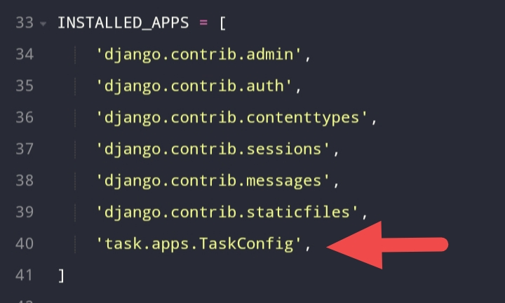
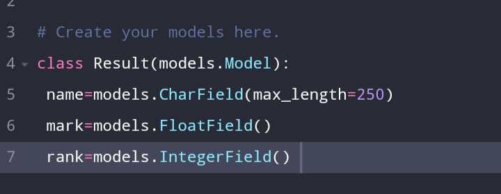
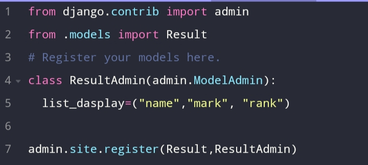
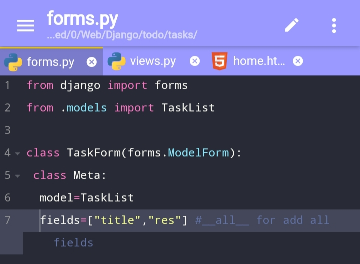

# 🔍Django_Notes

# ☢️Error
- Time_Zone <a href="https://github.com/Ag3ntQ/Django_TimeZone_solution">Click here for solution</a>
# 📌Part 1
# 💡Start New project
- django-admin startproject <project_name>
<code> django-admin startproject todo</code>
# 💡 Create New App
<code>python manage.py startapp task</code>
- Here 'task' is app name 
- THEN Config app with settings.py

<code>INSTALLED_APPS =[
.... task.apps.TaskConfig,]</code>
- here 'tasks' is app name,apps,'TasksConfig' got from class name in "apps.py"
- and config app urls.py with project urls.py
# 💡Project urls.py
- <code>from django.urls import include</code>
- Add path in "urlpatterns= [ ]"
- <code>path('{option}',include('{app_name}.urls')</code>
# 💡Views.py
- <code>form django.http import HttpResponse</code>
- HttpRsponce for 'text-response' 
<code>return HttpResponce("Hello World")</code>
- render - mapping file 
<code>return render(request,"index.html")</code>
# 💡 Templates
- template file save in app/templates
- <a href="https://docs.djangoproject.com/en/4.0/ref/templates/language/">Template language</a>
# 💡 Local hosting
- Start a local web server
- <code>python manage.py runserver 8000</code>
# 📌Part 2
# 💡models.py

- models.CharField(max_length=30)
- models.TextChoices("A", "B")
- models.IntegerField()"
- models.FloatField()
- models.FileField(upload_to=file)
- models.DateField()
- models.BooleanField(default=False)
- models.EmailField(max_length=250)
- models.ImageField(upload_to=None)
- models.URLField(max_length=200)
# 💡admin.py

- <code>admin.site.register({class_name})</code> for register models with admin panel
# 💡forms.py
- creating HTML forms for the data
- receiving and processing submitted forms and data from the client

